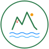

# 🎨 Design Guide - Seeuferweg Walensee Web App

## Überblick

Dieses Projekt integriert die professionellen Design-Styles von der offiziellen Seeuferweg Walensee Website. Alle Farben, Komponenten und Typografie wurden direkt von der offiziellen Site übernommen.

**Quelle der CSS-Styles:**
- `bundle-all.css` - https://seeuferweg-walensee.dev.cms.tso.ch/layout-canvas/styles/bundle-all.css
- `bundle-components.css` - https://seeuferweg-walensee.dev.cms.tso.ch/layout-canvas/styles/bundle-components.css

---

## 🌈 Farbschema

### Primärfarben

| Name | Hex | RGB | Verwendung |
|------|-----|-----|-----------|
| **Wald Grün** | `#2b7b4a` | 43, 123, 74 | Header, Buttons, Primary Actions |
| **Helles Grün** | `#4a9d6f` | 74, 157, 111 | Hover-Effekte, Light Accents |
| **Dunkles Grün** | `#1e5a35` | 30, 90, 53 | Header-Gradient, Dark Accents |

### Sekundärfarben

| Name | Hex | RGB | Verwendung |
|------|-----|-----|-----------|
| **Teal (Brand)** | `#1abc9c` | 26, 188, 156 | Seeuferweg-Markenfarbe, Feature Icons |
| **Wasser Blau** | `#1e90ff` | 30, 144, 255 | Accents, Highlights, Borders |
| **Helles Blau** | `#4eb3ff` | 78, 179, 255 | Gradients, Light Accents |

### Funktionale Farben

| Name | Hex | Verwendung |
|------|-----|-----------|
| **Erfolg** | `#27ae60` | Positive Messages, Success States |
| **Warnung** | `#f39c12` | Alert Messages, Warnings |
| **Fehler** | `#e74c3c` | Error States, Danger Actions |

### Neutrale Farben

| Name | Hex | Verwendung |
|------|-----|-----------|
| **Text Dunkel** | `#333` | Überschriften, Wichtiger Text |
| **Text Standard** | `#2c3e50` | Body Text, Standard |
| **Text Hell** | `#777` | Sekundärer Text, Hints |
| **Text Gedimmt** | `#5a6c7d` | Disabled Text, Meta-Info |
| **Hinter Light** | `#f5f5f5` | Light Backgrounds, Cards |
| **Grenze Hell** | `#eee` | Dividers, Borders |
| **Weiß** | `#fff` | Main Background, Card Backgrounds |

---

## 🏔️ Logo

Das Alpine Walensee Logo (`logo.svg`):

### Designelemente
- **Bergspitzen**: Symbolisiert die alpinen Glarner Alpen
- **Wasser-Wellen**: Repräsentiert den Walensee
- **Alpine Blüte**: Rot (#e74c3c) - Lokalflora
- **Sonne**: Gelb (#f39c12) - Alpenglow

### Farben im Logo
- Waldgrün (#2b7b4a) - Bergmassiv
- Wasser-Blautöne (#1e90ff, #4eb3ff) - Seen und Flüsse
- Rot (#e74c3c) - Alpine Blüte
- Gold (#f39c12) - Sonnenlicht

### Verwendung
```html

```

Das Logo lädt automatisch und versteckt sich, wenn die Datei nicht vorhanden ist.

---

## 📝 Typografie

### Schriftarten (von Seeuferweg übernommen)

```css
:root {
    --font-primary: 'Lato', sans-serif;         /* Body Text */
    --font-secondary: 'Raleway', sans-serif;    /* Überschriften */
    --font-accent: 'Crete Round', serif;        /* Spezielle Elemente */
}
```

### Größen & Gewichte

| Element | Font | Size | Weight | Case |
|---------|------|------|--------|------|
| H1 | Raleway | 36px | 700 | Normal |
| H2 | Raleway | 30px | 700 | Normal |
| H3 | Raleway | 24px | 700 | Normal |
| H4 | Raleway | 18px | 700 | Normal |
| Body | Lato | 14-16px | 400 | Normal |
| Button | Raleway | 15px | 600 | UPPERCASE |
| Small | Lato | 12-13px | 400 | Normal |

### Zeilenhöhe

- **Überschriften**: 1.5
- **Body**: 1.5
- **Buttons**: Depends on Size (Line Height = Height)

---

## 🎯 Komponenten-Styles

### Buttons

Die offizielle Seeuferweg Button-Implementierung:

**Basis-Button**
```css
display: inline-block;
background-color: #1abc9c;
color: #fff;
padding: 0 22px;
height: 40px;
line-height: 40px;
text-transform: uppercase;
letter-spacing: 1px;
font-weight: 600;
border: none;
border-radius: 3px;
cursor: pointer;
```

**Varianten**
- `.button` - Standard Teal
- `.button-dark` - Dunkel (#333)
- `.button-light` - Hell (#eee)
- `.button-mini` - 28px height
- `.button-small` - 34px height
- `.button-large` - 46px height
- `.button-xlarge` - 52px height

### Header

```css
background: linear-gradient(135deg, #2b7b4a 0%, #1e5a35 100%);
border-bottom: 3px solid #1e90ff;
padding: 0.75rem 2rem;
```

- Alpine Green Gradient oben
- Water Blue Unterrand
- Logo-Integration mit Auto-Fallback

### Cards & Tiles

```css
border: 1px solid #eee;
border-left: 4px solid #2b7b4a;
border-radius: 6px;
box-shadow: 0 2px 8px rgba(0, 0, 0, 0.1);
```

Hover-Effekt:
- Border wird zu Wasser Blau (#1e90ff)
- Shadow wird stärker
- Image zoomed um 5%

### Feature Boxes (von Seeuferweg)

```css
.feature-box .fbox-icon {
    width: 64px;
    height: 64px;
    background-color: #1abc9c;
    border-radius: 50%;
}

.feature-box h3 {
    text-transform: uppercase;
    letter-spacing: 1px;
    font-weight: 700;
}
```

### Divider

```css
position: relative;
margin: 35px 0;
border-top: 1px solid #eee;
```

### Promo Boxes

**Flat Style (Teal)**
```css
background-color: #1abc9c;
color: rgba(255, 255, 255, 0.9);
```

**Dark Style**
```css
background-color: #333;
color: #fff;
text-shadow: 1px 1px 1px rgba(0, 0, 0, 0.2);
```

### Title Blocks

```css
border-left: 7px solid #1abc9c;
padding: 0 20px 0 0;
```

Mit optionalen Untertext für Description.

---

## 📊 Responsive Design

### Breakpoints

```css
/* Desktop Extra Large */
@media (min-width: 1920px) { ... }

/* Desktop */
@media (min-width: 1200px) { ... }

/* Tablet Landscape */
@media (max-width: 1024px) { ... }

/* Tablet & Mobile */
@media (max-width: 768px) { ... }

/* Mobile Small */
@media (max-width: 480px) { ... }
```

### Responsive Änderungen

| Breakpoint | Header | Sidebar | Content |
|-----------|--------|---------|---------|
| 1920px+ | Full Width | 250px | Flex |
| 1024px | Full Width | 200px | Flex |
| 768px | Full Width | 150px | Stack |
| 480px | Compact | Hidden | 100% |

---

## 🎨 CSS Custom Properties

Alle Stile verwenden CSS Custom Properties für einfaches Theming:

```css
:root {
    /* Farben */
    --primary-color: #2b7b4a;
    --accent-lighter: #1abc9c;
    --accent-color: #1e90ff;
    --text-dark: #333;
    --text-color: #2c3e50;
    --text-light: #777;
    --bg-light: #f5f5f5;
    --border-light: #eee;
    
    /* Typografie */
    --font-primary: 'Lato', sans-serif;
    --font-secondary: 'Raleway', sans-serif;
    
    /* Spacing */
    --radius: 6px;
    --radius-sm: 3px;
    
    /* Schatten */
    --shadow: 0 2px 8px rgba(0, 0, 0, 0.1);
    --shadow-md: 0 4px 12px rgba(0, 0, 0, 0.15);
    --shadow-lg: 0 5px 15px rgba(0, 0, 0, 0.2);
}
```

---

## 🚀 Anwendungsbeispiele

### Header mit Logo

```html
<header class="header">
    <div class="header-content">
        <h1>
            
            Seeuferweg Walensee
        </h1>
    </div>
</header>
```

### Feature Card

```html
<div class="feature-box">
    <div class="fbox-icon">
        <i class="icon-mountain"></i>
    </div>
    <h3>Bergwanderung</h3>
    <p>Wandere entlang der schönen Ufer</p>
</div>
```

### Promo Section

```html
<div class="promo promo-flat">
    <h3>Entdecke die Schönheit</h3>
    <span>Der Walensee wartet auf dich</span>
    <a href="#" class="button">Mehr Erfahren</a>
</div>
```

### Title Block

```html
<div class="title-block">
    <h2>Unsere Touren</h2>
    <span>Wähle eine passende Wanderung</span>
</div>
```

---

## ✨ Animation & Transitions

Die App verwendet subtile Transitions:

```css
transition: all 0.3s ease;
```

**Animierte Elemente:**
- Button Hover: Farbe 0.2s
- Card Hover: Shadow + Scale 0.3s
- Modal Open: Fade 0.3s
- Image Hover: Scale 1.05 über 0.4s

---

## 🎯 Design-Prinzipien

1. **Alpine Nature Theme** - Grün & Blau Palette
2. **Minimalist & Clean** - Viel Whitespace
3. **Professional** - Seeuferweg-Standard Follow
4. **Accessible** - WCAG Compliance
5. **Responsive** - Mobile-First Approach
6. **Fast** - Optimierte Performance
7. **Consistent** - Einheitliche Komponenten

---

## 📚 CSS Dateien

| Datei | Größe | Beschreibung |
|-------|-------|------------|
| `styles.css` | ~30KB | Hauptstyle + Komponenten |
| `seeuferweg-components.css` | ~25KB | Erweiterte Komponentenbibliothek |
| **Total** | **~55KB** | Optimiert & komprimiert |

---

## 🔗 Weitere Ressourcen

- [SEEUFERWEG_STYLES.md](SEEUFERWEG_STYLES.md) - Detaillierte Komponenten-Dokumentation
- [START_HERE.md](START_HERE.md) - Quick-Start Guide
- [PROJECT_SUMMARY.md](PROJECT_SUMMARY.md) - Projekt-Übersicht
- Offizielle Website: https://seeuferweg-walensee.dev.cms.tso.ch

---

**Status:** ✅ Production Ready  
**Letztes Update:** 27. Januar 2026  
**Design Version:** 2.0 (Seeuferweg Integrated)
